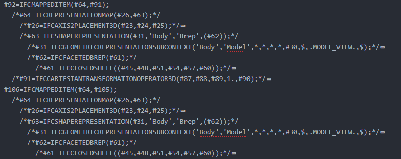
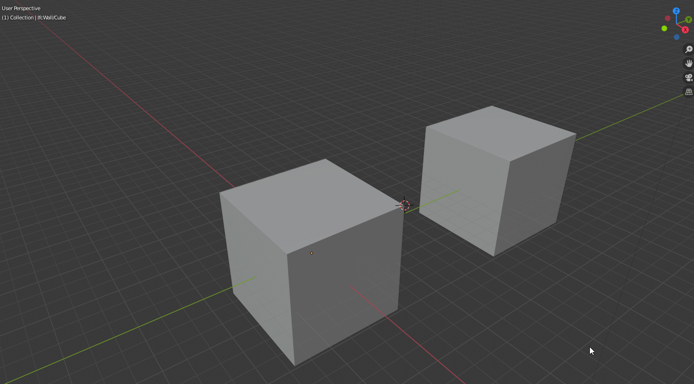
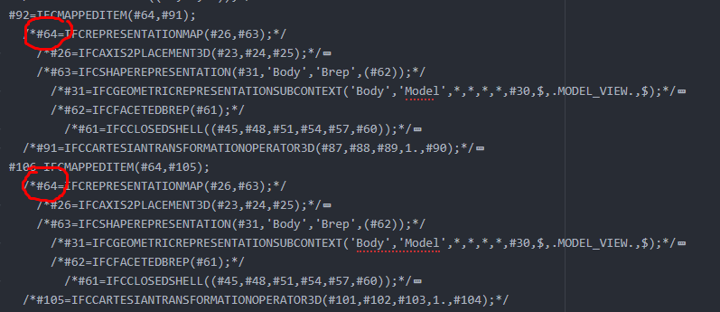

# IFC roundtripping specifications

This file lists "exercises" to be performed by a BIM application to achieve adequate round-tripping with IFC files. The application should successfully complete all the steps.

---

## File Naming Convension Examples:

| 1 – Original File   | 2 – Exported IFC File  | 3 – Imported Native File | 4 – Exported IFC File        | 5 – Imported Native File     |
| ------------------- | ---------------------- | ------------------------ | ---------------------------- | ---------------------------- |
| Extrusions_01.FCStd | Extrusions_02_PASS.ifc | Extrusions_03_PASS.rvt   | Extrusions_04_FAIL_rvt.ifc   | Extrusions_05_FAIL_rvt.rvt   |
|                     |                        |                          |                              | Extrusions_05_FAIL_rvt.FCStd |
|                     |                        | Extrusions_03_PASS.FCStd |                              |                              |
|                     |                        | Extrusions_03_PASS.blend | Extrusions_04_PASS_blend.ifc | Extrusions_05_PASS_blend.rvt |
|                     |                        | Extrusions_03_PASS.pln   | Extrusions_04_PASS_pln.ifc   | Extrusions_05_PASS_pln.pln   |
|                     |                        |                          |                              | Extrusions_05_PASS_pln.rvt   |

---

# Tests

---

## 1. Extrusions

The application should be able to export and import an IFC file containing three IfcBuildingElementProxy entities, each with one representation, which is an IfcExtrudedAreaSolid, each based on IfcArbitraryClosedProfileDef made of an IfcPolyline, like the example below. One profile should lie on the XY plane, one in the YZ plane, and a third on a plane made of one of the former rotated 45° along the Y axis. Extrusion directions should be normal to the profiles.


```
  #20= IFCBUILDINGELEMENTPROXY('0ohBfsArr3ruXYxacT4yl5',#1,'NOTDEFINED',$,$,#2,#21,$,.NOTDEFINED.);
    #21= IFCPRODUCTDEFINITIONSHAPE($,$,(#22));
      #22= IFCSHAPEREPRESENTATION(#9,'Body','SweptSolid',(#23));
        #23= IFCEXTRUDEDAREASOLID(#24,#31,#25,2000.);
          #24 = IFCARBITRARYCLOSEDPROFILEDEF(.AREA., $, #26);
            #26 = IFCPOLYLINE((#27, #28, #29, #30));
              #27 = IFCCARTESIANPOINT((0., 0.));
              #28 = IFCCARTESIANPOINT((1000., 0.));
              #29 = IFCCARTESIANPOINT((1000., 1000.));
              #30 = IFCCARTESIANPOINT((0., 1000.));
          #25= IFCDIRECTION((0.,0.,1.));
          #31= IFCAXIS2PLACEMENT3D(#32,#33,#34);
            #32= IFCDIRECTION((0.7071,0.,-0.7071));
            #33= IFCDIRECTION((0.7071,0.,0.7071));
            #34= IFCCARTESIANPOINT((1000.,0.,2000.));
```

#### Import criteria

* The extrusion directions and profile positions are correct
* The extrusions can be changed after import
* The base polylines can be edited after import

#### Export criteria

* The exported IFC file contains three 
  * IfcBuildingElementProxy, each with an 
    * IfcExtrudedAreaSolid as its representation and an 
      * IfcArbitraryClosedProfileDef made of an 
        * IfcPolyline as its profile.
* The positions and extrusion directions are correct when the IFC file is viewed with [ifc++](http://ifcquery.com)

#### Results

Test files here: [FreeMVD_WorkFlow/Specifications_Test_Files/Extrusions/](https://github.com/OpeningDesign/FreeMVD_WorkFlow/tree/master/Specifications_Test_Files/Extrusions)

| Program     | Version<br/>native/plugin | 3-Imported Native File | Import Comments    | 4-Exported IFC File | Export Comments                                                                                          |
| ----------- | ------------------------- | ---------------------- | ------------------ | ------------------- | -------------------------------------------------------------------------------------------------------- |
| ArchiCAD    |                           |                        |                    |                     |                                                                                                          |
| BlenderBIM  | 2.82a/0.200511            | FAILED                 | - imported as mesh | FAILED              | - changed IFCEXTRUDEDAREASOLID to IFCFACETEDBREP w/ IFCFACE                                              |
| FreeCAD     |                           | PASSED                 |                    | PASSED              |                                                                                                          |
| Revit       | 2020/20.1.0.1             | PASSED                 |                    | FAILED              | - Incorrect extrusion direction <br>- IFCARBITRARYCLOSEDPROFILEDEF was changed to IFCRECTANGLEPROFILEDEF |
| Vectorworks |                           |                        |                    |                     |                                                                                                          |

## 2. Mapped Items

Mapped Items, which go by many different names in different BIM apps (a few called out below), are objects where the definition of one object is connected to another.  That is, if one istance is modified, these changes will also be reflected in other connected or linked instances.



- ArchiCAD
  
  - Objects
  
  - Modules

- Blender
  
  - Linked Objects

- FreeCAD
  
  - Clones

- Revit
  
  - Groups
  
  - Families

- Microstation
  
  - Cells

- Vectorworks
  
  - Symbols



#### Import criteria

- That the connection or link between objects in still intact.  That is, if one instance is changed, the other instances will change as well.

#### Export criteria

- The IFC file has the same shared mapping connected to the objects--circled in red below.



| Program     | Version<br/>native/plugin | 3-Imported Native File | Import Comments                 | 4-Exported IFC File | Export Comments |
| ----------- | ------------------------- | ---------------------- | ------------------------------- | ------------------- | --------------- |
| ArchiCAD    |                           |                        |                                 |                     |                 |
| BlenderBIM  | 2.82a/0.200511            | PASSED                 |                                 | PASSED              |                 |
| FreeCAD     |                           |                        |                                 |                     |                 |
| Revit       | 2020/20.1.0.1             | FAILED                 | link was broken between objects |                     |                 |
| Vectorworks |                           |                        |                                 |                     |                 |
